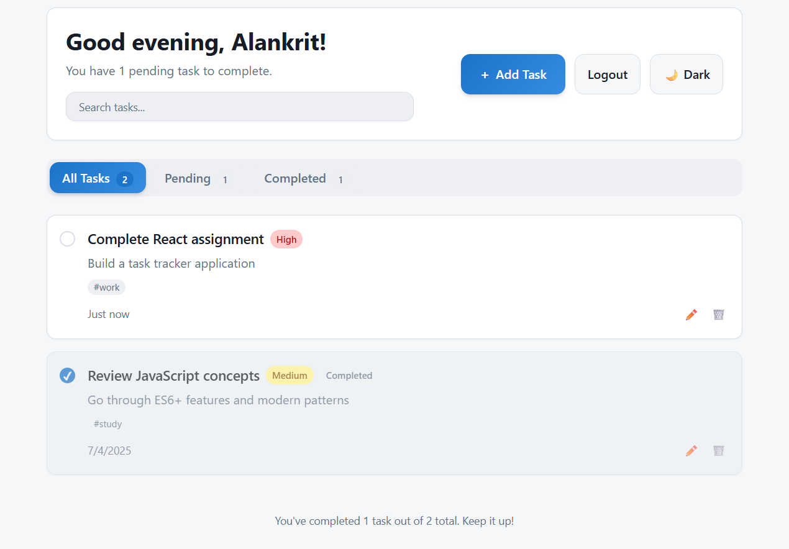
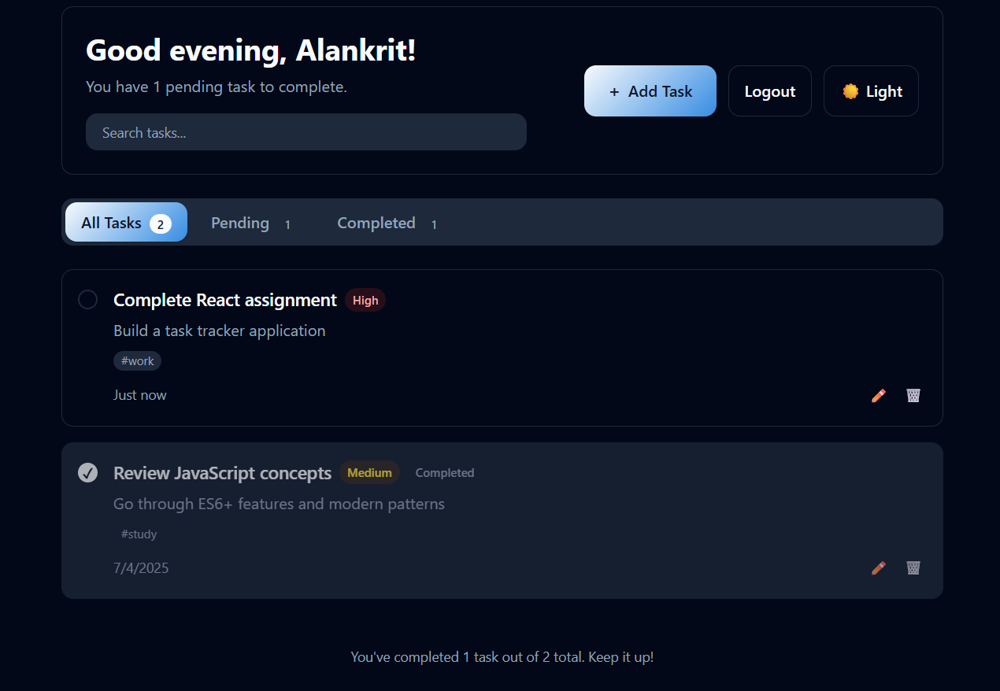

# Task Tracker

**Task Tracker** is a modern, responsive task management app built using React + TypeScript and styled with Tailwind CSS. It supports local task storage, tagging, filtering, search, dark mode, and smooth transitions — making productivity easier without needing a backend or login.

---

## Features

- **Search Functionality** – Instantly filter tasks by title or description.
- **Task Priority** – Choose between High, Medium, or Low for better focus.
- **Tags** – Categorize tasks with optional tags like `work`, `study`, or `personal`.
- **Dark Mode Toggle** – Switch themes seamlessly with one click.
- **Completion Toggle** – Mark tasks as done or reopen them anytime.
- **Responsive Design** – Optimized for mobile, tablet, and desktop.
- **Smooth Animations** – Subtle motion for task cards, modals, and filters.
- **Local Storage** – No account or signup required. Your tasks stay on your device.

---

## Tech Stack

- **React 18 + Vite**
- **TypeScript**
- **Tailwind CSS (with custom HSL theming)**
- **React Router DOM**
- **Local Storage API**
- **React Context for Theme**
- **ShadCN-inspired components**
- **Custom Toaster System**

---

## How It Works

- You enter a name once — no signup/login.
- Tasks are saved in your browser’s local storage.
- You can:
  - Add, edit, delete, and complete tasks.
  - Assign tags and priorities.
  - Filter by All / Pending / Completed.
  - Search by keywords.
  - Toggle between light and dark mode.

Tasks are sorted by:
1. Priority (High > Medium > Low),
2. Creation time (Newer first).

---

## Optional Enhancements
- These can be added in the future:

1. Due dates and calendar view
2. Drag & drop for reordering
3. Cross-device sync with backend
4. Voice input for tasks

---

## Preview

### Light Mode


### Dark Mode


---

## Setup Instructions

Clone the project and run it locally:

```bash
git clone https://github.com/KritAlankrit/TaskTracker.git
cd TaskTracker
npm install
npm run dev
Open http://localhost:3000 in your browser.

---

## Live Demo

[Click here to view the live site](https://task-tracker-phi-pied.vercel.app/)

